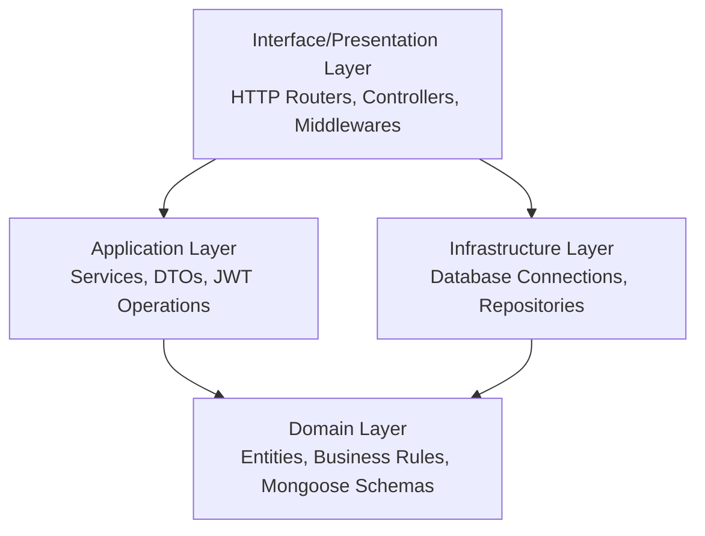

# Payment Processing System - Architecture & Implementation Guide

This document provides a comprehensive analysis of the project's architecture, patterns, directory structure, and details for every file. It is designed to serve as a complete technical guide for an AI code assistant to understand, maintain, and extend the system.

---

## 🏛️ Architectural Style: Domain-Driven Design (DDD) & Clean Architecture

The codebase is structured around **Domain-Driven Design (DDD)** and **Clean Architecture** principles, enforcing separation of concerns, decoupling business logic from external frameworks, and maintaining dependency inversion. 

The application is split into four primary layers, plus configurations and utilities:



- **Domain Layer (`src/domain`)**: Core business entities and rules. It has zero external dependencies other than database models definition.
- **Infrastructure Layer (`src/infrastructure`)**: Database configuration and data-access adapters. Implements the Repository pattern.
- **Application Layer (`src/application`)**: Use-cases, business workflows, application services, and data transfer definitions (DTOs).
- **Interface Layer (`src/interface`)**: Request handlers (Controllers), routing, and HTTP-specific middleware (auth, DTO validation, error handling).

---

## 📁 Directory & File Hierarchy

```
.
├── .eslintignore
├── .prettierignore
├── .prettierrc
├── tsconfig.json
├── package.json
├── eslint.config.mjs
├── scripts/
│   ├── loader.js           # ts-node ESM loader with error handling
│   └── register.js         # Registers @swc-node compiler for ts execution
└── src/
    ├── app.ts              # Entry point
    ├── config/             # System config (Express Server, Env, Logger)
    │   ├── env.config.ts
    │   ├── index.ts
    │   ├── logger.ts
    │   └── server.ts
    ├── domain/             # Core DDD business models
    │   ├── models/
    │   │   ├── index.ts
    │   │   └── User.ts
    │   └── index.ts
    ├── infrastructure/     # DB configs and Repository Pattern
    │   ├── database.config.ts
    │   ├── index.ts
    │   └── repositories/
    │       └── GenericRepository.ts
    ├── application/        # Use-cases, services, DTOs
    │   ├── dtos/
    │   │   └── User/
    │   │       └── user.dto.ts
    │   └── services/
    │       ├── index.ts
    │       └── Auth/
    │           ├── AuthService.ts
    │           └── JwtService.ts
    ├── interface/          # HTTP adapters (routing, controllers, middleware)
    │   ├── controllers/
    │   │   ├── index.ts
    │   │   └── user.controller.ts
    │   ├── middleware/
    │   │   ├── auth/
    │   │   │   ├── authGuard.ts
    │   │   │   └── userDeserialiser.ts
    │   │   ├── cors/
    │   │   │   └── cors.ts
    │   │   ├── dtos/
    │   │   │   ├── socket.validation.ts
    │   │   │   └── validation.ts
    │   │   ├── error/
    │   │   │   └── error.ts
    │   │   └── interceptor/
    │   │       └── app.interceptor.ts
    │   └── routers/
    │       ├── index.ts
    │       └── user.router.ts
    └── utils/
        └── asyncHandler.ts  # Express async wrapper
```

---

## 🔍 File-by-File Breakdown & Code Analysis

### 1. Bootstrapping & Script Utilities

#### 📄 `src/app.ts`
- **Purpose**: Application bootstrap entry point.
- **Details**: Imports `reflect-metadata` and `express-async-errors`. Reads configuration, creates a `Server` instance from `@/config`, and starts it.

#### 📄 `scripts/register.js`
- **Purpose**: Configures swc-node ESM loader.
- **Details**: Hooks runtime TypeScript compilation using `@swc-node/register/esm` for fast execution. Includes global process event handlers for `uncaughtException` and `unhandledRejection`.

#### 📄 `scripts/loader.js`
- **Purpose**: Enhanced custom TypeScript module loader.
- **Details**: Configures tsconfig paths aliases (`@/*` -> `./src/*`) and registers them dynamically in the ESM runtime using `ts-node/esm` and `tsconfig-paths`. Implements detailed error formatting for module resolution and unhandled rejections.

---

### 2. Configurations (`src/config`)

#### 📄 `src/config/env.config.ts`
- **Purpose**: Environment variable configuration.
- **Details**: Parses the `.env` file (located in the project root directory relative to this file) and exports `PORT`, `DATABASE_URL`, `JWT_SECRET`, and `ENV` constants.

#### 📄 `src/config/server.ts`
- **Purpose**: Express Application configuration & orchestration class.
- **Details**:
  - Initializes Express, mounts JSON parsers, and mounts the application router (`appRouter`) on `/api`.
  - Establishes a graceful shutdown loop handling `SIGTERM`, `SIGINT`, `uncaughtException`, and `unhandledRejection` signals to close the HTTP server and database connections cleanly.

#### 📄 `src/config/logger.ts`
- **Purpose**: Application logger setup.
- **Details**: Exposes a `pino` logger writing to `stdout`. Automatically switches log level to `"error"` in production (`ENV === "PROD"`) and `"info"` in development.

#### 📄 `src/config/index.ts`
- **Purpose**: Clean export barrel.
- **Details**: Exports everything from `env.config` and `server`.

---

### 3. Domain Layer (`src/domain`)

#### 📄 `src/domain/models/User.ts`
- **Purpose**: Database User schema entity.
- **Details**: Implements a simple mongoose schema for the `User` model, enforcing `email` and `password` validation.

---

### 4. Infrastructure Layer (`src/infrastructure`)

#### 📄 `src/infrastructure/database.config.ts`
- **Purpose**: Database connection manager.
- **Details**: Exposes `connectToDatabase` and `disconnectFromDatabase` using `mongoose`. Implements high-performance connection options (`maxPoolSize: 10`, timeout controls) and handles connection states dynamically.

#### 📄 `src/infrastructure/repositories/GenericRepository.ts`
- **Purpose**: A highly generic, decoupled Repository pattern implementation.
- **Details**:
  - **Segregated Interfaces**: Splits reads (`IReadRepository`), writes (`IWriteRepository`), deletes (`IDeleteRepository`), and bulk/aggregation operations (`IBulkRepository`) to respect the Interface Segregation Principle.
  - **Base Mongoose Repositories**: Implements generic classes `ReadOnlyRepository`, `WriteRepository`, and `Repository` that hook directly into Mongoose Models.
  - **Database Hooks / Lifecycle Hooks**: Employs Template Method pattern with `beforeCreate`, `afterCreate`, `beforeUpdate`, `afterUpdate`, and `beforeDelete` hooks.
  - **Database Transactions**: Exposes `withTransaction(operation)` supporting MongoDB multi-document transactions using Mongoose sessions.
  - **Repository Factory**: Exposes a static `RepositoryFactory` class to instantiate `ReadOnly`, `Writable`, or `Full` repositories.
  - **Implementations**: Provides a concrete `UserRepository` demonstrating how to override hooks and add custom domain queries.

---

### 5. Application Layer (`src/application`)

#### 📄 `src/application/dtos/User/user.dto.ts`
- **Purpose**: Request validation and response serialization blueprints.
- **Details**:
  - Leverages `class-validator` and `class-transformer` decorators to enforce strict types.
  - Exposes `CreateUserDto` (contains password strength regex checking), `UpdateUserDto`, `LoginDto`, and query schemas (`GetUsersQueryDto`).
  - Exposes `UserResponseDto` using `@Expose()` to serialize database entities while hiding sensitive fields (like password digests) when returning JSON payloads to client.

#### 📄 `src/application/services/Auth/AuthService.ts`
- **Purpose**: Core authentication workflow.
- **Details**: Coordinates signup (verifies user uniqueness, persists record) and login mechanisms (verifies user credentials).

#### 📄 `src/application/services/Auth/JwtService.ts`
- **Purpose**: JSON Web Token generator and validator.
- **Details**: Wraps `jsonwebtoken` to issue short-lived access tokens (1 hour) and long-lived refresh tokens (1 year), verify signatures, and decode headers.

---

### 6. Interface Layer (`src/interface`)

#### 📄 `src/interface/controllers/user.controller.ts`
- **Purpose**: HTTP Controller for User routes.
- **Details**: Bridges the HTTP layer and `AuthService`. Delegates arguments and handles responses.

#### 📄 `src/interface/routers/user.router.ts`
- **Purpose**: Routing definition.
- **Details**: Connects `/users` paths to controller handlers. Chains request validation (`UseRequestDto`) and response serialization (`UseResponseDto`) middlewares before processing.

#### 📄 `src/interface/middleware/dtos/validation.ts`
- **Purpose**: Core Request/Response transformation interceptors.
- **Details**:
  - `UseRequestDto(dto)`: Re-instantiates `req.body` to a typed class instance, validates it against `class-validator` rules, and rejects invalid formats early using a `ValidationError`.
  - `UseResponseDto(dto)`: Hijacks Express `res.json` method. If the outgoing body resembles a database entity or list of entities, it converts it via class-transformer using `@Expose()` tags, ensuring no unexposed columns or sensitive variables escape the interface.

#### 📄 `src/interface/middleware/auth/userDeserialiser.ts`
- **Purpose**: Session state builder.
- **Details**: Inspects the incoming `Authorization: Bearer <token>` header, decodes the JWT payload, queries database for the matching entity using a `UserRepository` instance, and populates `req.user`.

#### 📄 `src/interface/middleware/auth/authGuard.ts`
- **Purpose**: Authorization protector.
- **Details**: Implements `IsAuthenticated` middleware to check for `req.user`. Also extends the Express globally-declared namespaces so that the TypeScript compiler understands `req.user`.

#### 📄 `src/interface/middleware/error/error.ts`
- **Purpose**: Centralized error management middleware.
- **Details**:
  - Exposes custom error subclasses: `AppError`, `NotFoundError`, `BadRequestError`, `UnauthorizedError`, `ValidationError`, etc.
  - Catches database errors (Mongoose CastError, duplicate keys `11000`, validation faults) and standardizes them into unified JSON formats before responding to client.

#### 📄 `src/interface/middleware/interceptor/app.interceptor.ts`
- **Purpose**: Router response serializing alternative.
- **Details**: Hooks `res.json` to serialize responses against `res.locals.responseDTO` dynamically.

#### 📄 `src/interface/middleware/cors/cors.ts`
- **Purpose**: CORS configuration.

#### 📄 `src/interface/middleware/dtos/socket.validation.ts`
- **Purpose**: Leftover placeholder socket validation.
- **Details**: Uses `zod` schemas for socket validation (note: `zod` is not a direct dependency in `package.json`).

---

### 7. Centralized Utilities (`src/utils`)

#### 📄 `src/utils/asyncHandler.ts`
- **Purpose**: Catch express route exceptions.
- **Details**:
  - `asyncHandler(fn)`: Wraps asynchronous Express route handlers to capture errors and forward them directly to the `next` handler.
  - `socketAsyncHandler(fn)`: Catch errors during asynchronous Web Socket executions.

---

## 🔄 Lifecycle Data Flows

### A. HTTP Request Processing Flow (REST Request to Route)

```
[HTTP Client Request]
       │
       ▼
[app.ts / server.ts] (Express Engine)
       │
       ▼
[userDeserializer] (Parses Bearer Token and binds user to req.user)
       │
       ▼
[IsAuthenticated] (Optionally gates access if authentication is mandatory)
       │
       ▼
[UseRequestDto(DtoClass)] (Validates body schema and throws ValidationError on failure)
       │
       ▼
[UseResponseDto(DtoClass)] (Overrides res.json to filter fields on exit)
       │
       ▼
[asyncHandler(UserController)] (Executes controller method, safety-catching errors)
       │
       ▼
[AuthService / Business Logic] (Executes business process)
       │
       ▼
[Repository / DB Action] (Accesses DB)
       │
       ▼
[Controller responds via res.json]
       │
       ▼
[UseResponseDto Interceptor Filters Properties]
       │
       ▼
[HTTP Client Response]
```

### B. Central Exception Handling
If any error occurs in the request path, the `asyncHandler` captures it and sends it to `next(error)`. The centralized `errorHandler`:
1. Identifies if the error is a custom `AppError` and responds with its status code.
2. Identifies if the error is a database validation or duplicate key issue and maps it to a standard 400 Bad Request.
3. Identifies JWT issues (expired or invalid signatures) and maps them to 401 Unauthorized.
4. If in development, returns the full stack trace; otherwise, displays a generic 500 error message.

---

## 🛠️ Developer Integration Guide: How to Extend

Follow these exact steps when instructing an AI or developer to add new business features (like a **Payment** feature) to this repository:

### Step 1: Define the Domain Model
Create a mongoose entity under `src/domain/models/Payment.ts`:
```typescript
import mongoose, { Schema, Document, model } from 'mongoose';

export interface IPayment extends Document {
  amount: number;
  currency: string;
  status: 'pending' | 'completed' | 'failed';
  userId: mongoose.Types.ObjectId;
}

const PaymentSchema = new Schema<IPayment>({
  amount: { type: Number, required: true },
  currency: { type: String, required: true },
  status: { type: String, enum: ['pending', 'completed', 'failed'], default: 'pending' },
  userId: { type: Schema.Types.ObjectId, ref: 'User', required: true }
}, { timestamps: true });

export const Payment = model<IPayment>('Payment', PaymentSchema);
```
*Export it inside `src/domain/models/index.ts`.*

### Step 2: Set up the Repository
If you need custom query patterns, extend the repository model under `src/infrastructure/repositories/PaymentRepository.ts`:
```typescript
import { Model } from 'mongoose';
import { Repository } from './GenericRepository';
import { IPayment } from '@/domain/models/Payment';

export class PaymentRepository extends Repository<IPayment> {
  constructor(model: Model<IPayment>) {
    super(model);
  }

  async findPaymentsByUser(userId: string): Promise<IPayment[]> {
    return this.findMany({ userId });
  }
}
```

### Step 3: Implement Services and DTOs
Create your Data Transfer Objects (DTO) class-validators:
```typescript
// src/application/dtos/Payment/payment.dto.ts
import { IsNumber, IsString, IsNotEmpty, IsPositive } from 'class-validator';
import { Expose } from 'class-transformer';

export class CreatePaymentDto {
  @IsNumber()
  @IsPositive()
  @IsNotEmpty()
  amount!: number;

  @IsString()
  @IsNotEmpty()
  currency!: string;
}

export class PaymentResponseDto {
  @Expose()
  _id!: string;
  
  @Expose()
  amount!: number;
  
  @Expose()
  currency!: string;
  
  @Expose()
  status!: string;
}
```

Then create the Service layer matching:
```typescript
// src/application/services/Payment/PaymentService.ts
import { Payment } from '@/domain/models/Payment';
import { PaymentRepository } from '@/infrastructure/repositories/PaymentRepository';

export class PaymentService {
  private paymentRepo: PaymentRepository;
  
  constructor() {
    this.paymentRepo = new PaymentRepository(Payment);
  }

  async createPayment(userId: string, data: { amount: number; currency: string }) {
    return this.paymentRepo.create({
      ...data,
      userId: userId as any,
      status: 'pending'
    });
  }
}
```

### Step 4: Hook Interface Controllers and Routers
Create the controller to receive API endpoints:
```typescript
// src/interface/controllers/payment.controller.ts
import { Request, Response } from 'express';
import { PaymentService } from '@/application/services/Payment/PaymentService';

export class PaymentController {
  private paymentService: PaymentService;

  constructor(paymentService: PaymentService) {
    this.paymentService = paymentService;
  }

  processPayment = async (req: Request, res: Response) => {
    const payment = await this.paymentService.createPayment(req.user!._id, req.body);
    return res.status(201).json(payment);
  }
}
```

Mount it within a route using route-level DTO validations:
```typescript
// src/interface/routers/payment.router.ts
import { Router } from 'express';
import { PaymentController } from '../controllers/payment.controller';
import { PaymentService } from '@/application/services/Payment/PaymentService';
import { UseRequestDto, UseResponseDto } from '../middleware/dtos/validation';
import { CreatePaymentDto, PaymentResponseDto } from '@/application/dtos/Payment/payment.dto';
import { IsAuthenticated } from '../middleware/auth/authGuard';
import { asyncHandler } from '@/utils/asyncHandler';

const router = Router();
const paymentController = new PaymentController(new PaymentService());

router.post(
  '/',
  IsAuthenticated,
  UseRequestDto(CreatePaymentDto),
  UseResponseDto(PaymentResponseDto),
  asyncHandler(paymentController.processPayment)
);

export default router;
```
*Register this route inside `src/interface/routers/index.ts`.*
# paymentProcessingSystem
